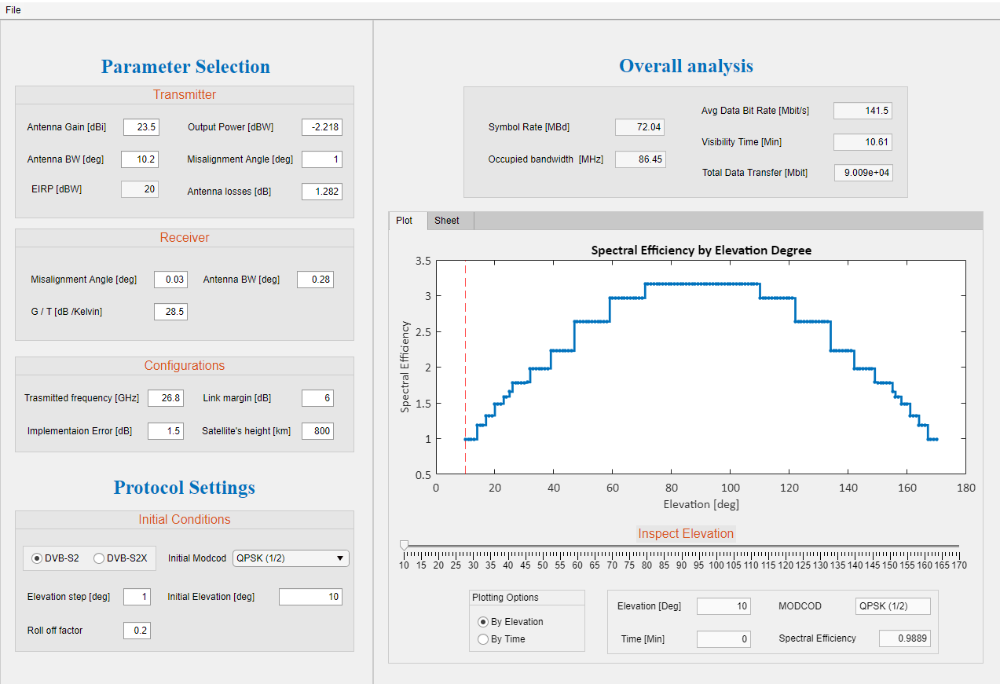

# Link-Budget-Calculator
<h1 align="center">
  <br>
 Study of Space to Earth Communication Link - Link Budget Calculator
  <br>
</h1>
  <p align="center">
    <a href="https://github.com/Orelbenr">Orel Ben-Reuven</a> •
    <a href="">Tomer Fait</a> •
    <a href="">Alexander Hodisan</a>
  </p>
<h4 align="center">
<p>Project B @ Comm Lab</p>
<p>Technion - Israel Institute of Technology</p>
</h4>

<h4 align="center">
<a href="Report/KA_Satellite_Link_Project_Report.pdf">Project Report</a> --
<a href="Report/KA_Satellite_Link_Project_Presentation.pdf">Project Presentation</a>
</h4>

<p align="center">

<a href="https://github.com/Orelbenr/link-budget-calculator">
    
</a>

</p>

## Table of Contents

* [Background](#background)
* [Installation](#installation)
* [Contents](#contents)
* [References](#references)


## Background
The Link Budget calculator determines the optimal DVB-S2 / DVB-S2X Modcods (Modulation and Coding) for maximum data transfers, assuming downlink transmission of a  Leo satellite orbit above the base station. 
The inputs for the calculator are the specifications of the satellite's transmitter, grounds station's receiver, and additional design parameters.

## Installation

There are two ways to install the calculator:
1) [As a Matlab Add-On](#matlab-add-on-installation)
2) [As a StandAlone App](#standalone-app-installation)

The first method requires a Matlab installation on the desired computer, whereas the second method does not require any prerequisites. The instructions for both methods are listed below.

### Matlab Add-On Installation
1) Clone the repo
```sh
git clone https://github.com/Orelbenr/link-budget-calculator.git
```
2) Install the following application:
```sh
/App Installers/Link Budget Calculator-Addon Installer.mlappinstall
```

### StandAlone App Installation


1) Clone the repo
```sh
git clone https://github.com/Orelbenr/link-budget-calculator.git
```
2) Install the following application::
```sh
/App Installers/Link Budget Calculator-Standalone Installer.exe
```


## Contents

|Directory      | Content |
|----------------------|------|
|`/App Installers`| Directory containing the installation files for the calculator|
|`/Matlab Source`| Directory containing the Matlab implementation of the calculator|
|`/Report`| Directory containing the Project report and presentation |
|`/Project Learning Material`| Directory containing the references materials we used|


## References
* [1] AtlantaRf, “Sattelites-LEO-MEO-GEO,” http://www.atlantarf.com/.

* [2] P. D. S. Wu, “CubeSats: Tiny Satellite – A Big World,” Shanghai 201203, China.

* [3] M. B. Z. S.e. Gerard Maral, Satellite Communications Systems: Systems, Techniques and Technology 5th Edition.

* [4] ETSI, “EN 302 307-1 - DVB-S2,” V1.4.1, 2014-11.

* [5] ETSI, “EN 302 307-2 - DVB-S2X,” V1.2.1, 2020-05.

* [6] Satellites - Orbits and Missions, Michel Capderou, Springer 2005

* [7] K. S. SERVICES, “KA-BAND AND THE FUTURE OF BIG DATA FROM SPACE_KSAT,” https://www.ksat.no/globalassets/ksat/documents/ksat_white_paper.pdf.